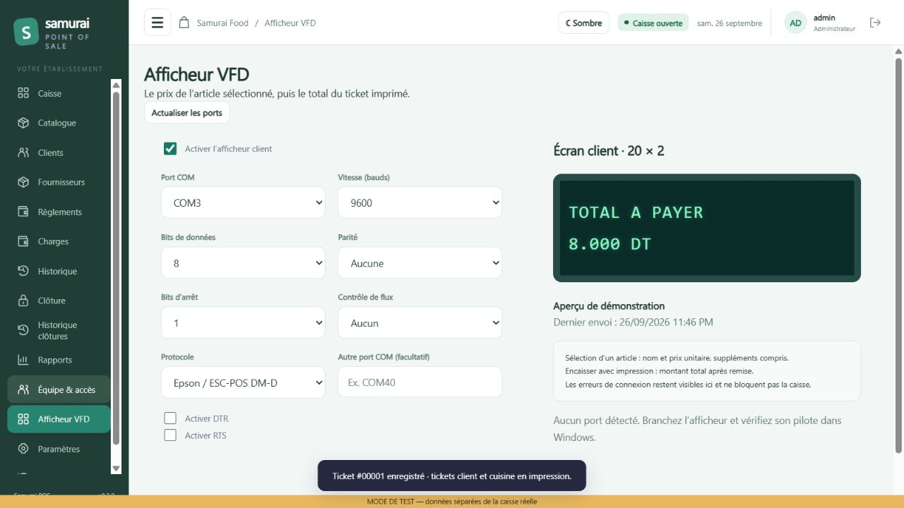

# Samurai POS — Nouvelle application

Application Windows de caisse avec base locale SQLite et service de synchronisation séparé. Interface et moteur de caisse nouveaux. La base et les secrets de la démonstration ne sont pas inclus dans l’exécutable.

## Installation et hébergement

- [Installer la caisse hors ligne chez le client](INSTALLATION-CLIENT.md) : fichier EXE portable, premier démarrage et sauvegarde.
- [Configurer le suivi sur Vercel](DEPLOIEMENT-VERCEL.md) : construction web, PostgreSQL, variables privées et liaison avec la caisse.
- La version en ligne propose Rapports, Clôtures, Clients, Fournisseurs, Charges, Règlements et Synchronisations. Le fichier Windows continue de fonctionner hors ligne.

## Construire depuis GitHub

Ce dépôt contient la version 0.3.2 : application bureau, serveur de synchronisation, captures et 48 tests. Les bases de caisse, secrets, dépendances et exécutables générés ne sont pas versionnés.

Sur Windows, installer Node.js 20 ou supérieur puis exécuter :

```powershell
git clone https://github.com/yassinmejdoub284-cmd/pos-1.git
cd pos-1
npm ci
npm test
npm run build
```

L’exécutable est créé dans `release/Samurai-POS-0.3.2.exe`. `npm start` lance l’application en développement ; `npm run preview` lance une démonstration séparée. GitHub Actions vérifie les tests sur Windows à chaque modification publiée.



## Démarrer sur Windows

1. Ouvrir `release/Samurai-POS-0.3.2.exe`.
2. Au premier lancement, créer l’établissement, le compte administrateur et son code personnel. Aucun code de production n’est préinstallé.
3. Créer les familles, produits, suppléments, commentaires et catégories de charges dans le catalogue.
4. Dans **Catalogue → Organiser l’affichage**, sélectionner un produit, cliquer sur sa nouvelle place et enregistrer. Les pages de caisse contiennent 12 produits, sauf la dernière si le catalogue n’est pas un multiple de 12. Les filtres conservent l’ordre choisi.
5. Dans **Paramètres → Imprimantes & tickets**, sélectionner les imprimantes client et cuisine. Sur ce poste, Windows détecte **Xprinter XP-80 / USB001**. Vérifier le papier 80 mm dans le pilote Windows. Si une seule imprimante physique est détectée et aucun choix enregistré, elle est sélectionnée au démarrage.
6. Ouvrir une session avec son fond de caisse puis commencer les ventes.

Le premier lancement nécessite l’accès habituel en écriture au dossier AppData du compte Windows. Node, Internet et le dossier du code source ne sont pas nécessaires pour utiliser l’exécutable. Les données restent dans le dossier de données Electron de l’application sous AppData/Roaming, avec le fichier `samurai-pos.sqlite`.

## Vider l'historique local

Dans **Paramètres → Réglages de caisse → Vider le stockage**, l'administrateur peut retirer les ventes et clôtures de ce poste après avoir fermé toutes les caisses et saisi le code de sécurité prévu. Sauvegarder d'abord la base avec le bouton des paramètres. Les charges, règlements, soldes clients, produits, familles, fournisseurs, employés et réglages sont conservés. Les données déjà synchronisées restent dans la base en ligne. Des références techniques minimales aux anciennes sessions sont conservées localement lorsque des charges ou règlements en dépendent ; leurs détails de clôture sont effacés et ne figurent plus dans les historiques.

## Encaissement direct

- **Encaisser et imprimer** enregistre la vente et envoie les tickets client et cuisine sans fenêtre de validation ni aperçu.
- **Encaisser sans impression** enregistre la vente sans créer de tâche d’impression, même si l’impression automatique est activée dans les paramètres.
- Un client de passage est encaissé en espèces. Le champ reçu est facultatif : laisser vide signifie montant exact ; saisir une somme permet de calculer la monnaie.
- Pour un client sélectionné, choisir Espèces, Carte ou Crédit dans la caisse avant de cliquer sur l’un des deux boutons. Les paiements par carte doivent avoir été acceptés sur le terminal bancaire.
- F4 encaisse avec les deux impressions. Les boutons sont bloqués pendant l’enregistrement.
- Le bouton ☰ en haut masque ou affiche le menu ; le choix est conservé sur le poste.

## Règlements et charges à crédit

Dans Charges, choisir **Crédit fournisseur** et un fournisseur. Cela enregistre la charge et une dette sans sortir d’espèces. Le module **Règlements** possède les onglets Clients et Fournisseurs, avec paiement partiel ou total, solde restant et historique. Un règlement client en espèces augmente la caisse ; un règlement fournisseur en espèces la diminue. Les règlements fournisseurs bancaires ne touchent pas la caisse. La charge déjà enregistrée n’est pas ajoutée une seconde fois aux dépenses au moment du règlement.

Les droits Clients et Fournisseurs contrôlent les onglets et les opérations. Les dettes fournisseurs sont calculées sur ce poste, comme les crédits clients : réserver le crédit d’un même compte à une caisse.

## Afficheur client VFD / COM

Dans **Afficheur VFD**, choisir COM1, COM2, COM3… Les ports Windows détectés sont indiqués ; un champ permet de saisir un port supérieur à COM32. Régler la vitesse, les bits, la parité, le contrôle de flux et le protocole selon le fabricant, activer, enregistrer puis cliquer **Tester l’afficheur**. L’activation est désactivée par défaut ; aucun port n’est ouvert avant un envoi demandé.

L’article sélectionné affiche son nom et son prix unitaire, suppléments compris. **Encaisser et imprimer** affiche le total après remise, conservé jusqu’à la prochaine sélection. Une réimpression affiche également le total du ticket. Les noms sont limités à 20 caractères par ligne et les accents simplifiés. Le module propose Epson / ESC-POS DM-D et texte brut CR/LF ; les autres protocoles nécessitent une adaptation au modèle. Le protocole Epson utilise les [commandes officielles des afficheurs DM-D](https://download4.epson.biz/sec_pubs/pos/reference_en/escpos_dm/commands.html).

L’envoi passe directement par le port série Windows, avec connexion maintenue et fermeture à la sortie. Une erreur est affichée dans le module et laisse la vente enregistrable. L’aperçu navigateur simule les envois et ne pilote aucun appareil. Sur ce poste, COM6 et COM7 sont détectés ; aucun n’a été choisi à votre place. L’envoi sur l’afficheur réel reste à tester avec son modèle et son port.

## Modules

- Apparence : palette verte douce et thèmes clair/sombre conservés sur le poste.
- Caisse : sur place par défaut, grandes options, espèces, carte, crédit client, quantité, remise plafonnée, sur place/à emporter/livraison, recherche et pages de 12 produits.
- Catalogue : vues tableau et grille, familles, produits, positions, suppléments autorisés par produit, commentaires et choix d’impression client/cuisine.
- Suppléments : attachés à la ligne sélectionnée, facturés par quantité et imprimés sous leur produit avec une flèche.
- Fournisseurs : coordonnées, contact, matricule fiscal et achats liés aux charges.
- Clients : coordonnées, plafond de crédit, solde et règlements.
- Charges : catégories, dépenses bancaires ou espèces, prise en compte dans la clôture.
- Historique : 100 derniers tickets, aperçu client/cuisine, réimpression et annulation avec motif. Tous les tickets restent dans la base et les rapports par date.
- Clôture : ventes, règlements, remboursements, charges, espèces attendues/comptées et explication d’un écart.
- Historique des clôtures : toutes les clôtures conservées, filtres de dates et de caissier, montants attendus/comptés, écarts, observation et réimpression 80 mm. Un caissier consulte ses clôtures ; la permission Rapports autorise la consultation de tous les caissiers.
- Rapports : période, famille, produit, paiement, type de service et caissier ; panier moyen, répartition par famille/produit et évolution quotidienne. Les remises sont réparties exactement en millimes. Les charges restent globales à la période. Impression 80 mm avec les filtres appliqués.
- Équipe : comptes avec codes protégés, permissions vérifiées dans le moteur et protection du dernier administrateur.
- Paramètres : entreprise, logo, tickets, imprimantes, remises, sauvegarde et synchronisation.
- Synchronisation : file durable, reprise réseau, identifiants uniques, conflits de catalogue à résoudre et tableau de bord en ligne.

## Impression et sauvegarde

L’impression utilise le pilote Windows, sans modifier les composants OPOS existants. Le bouton Encaisser et imprimer demande les deux tickets, quels que soient les réglages automatiques. Le bouton sans impression prend priorité sur ces réglages. Le justificatif de clôture reste automatique selon le paramètre enregistré. Les deux tickets sont envoyés successivement, même lorsqu’une première impression échoue. Les choix peuvent être modifiés dans les paramètres. La mise à jour 0.2 active ces trois options une seule fois pour répondre au nouveau fonctionnement demandé. Les erreurs restent visibles dans l’historique. Après une interruption pendant l’impression, vérifier le papier avant une réimpression.

**Paramètres → Sauvegarder la base** crée un fichier SQLite cohérent contenant les ventes et comptes. Le conserver sur un autre support. Le secret de synchronisation reste séparé et protégé par Windows. Pour restaurer une sauvegarde, fermer l’application et conserver une copie du dossier de données actuel avant de remplacer `samurai-pos.sqlite` par la sauvegarde. Ne pas remplacer une base pendant que l’application est ouverte.

## Synchronisation toutes les 20 minutes

Le serveur Internet n’est pas encore fourni. L’application fonctionne hors ligne pendant ce temps. Le service `backend/cloud.mjs` et le tableau de bord sont prêts pour leur hébergement.

Les échanges ont lieu lorsque l’application bureau est **ouverte** : au démarrage si la dernière réussite date de plus de 20 minutes, puis toutes les 20 minutes après une réussite, avec une vérification chaque minute. Une erreur laisse les opérations en attente et entraîne de nouvelles tentatives après 5 minutes. Le bouton manuel est disponible.

Les ventes, clôtures, charges et règlements sont consolidés en ligne. Le catalogue et les clients sont échangés entre les postes ; les conflits sont présentés à l’utilisateur. Les soldes clients sur le poste restent calculés à partir des ventes et règlements de ce poste : utiliser une seule caisse pour le crédit d’un même client. Les comptes, permissions, imprimantes et secrets restent propres au poste.

La nouvelle API n’est pas reliée automatiquement à l’ancien projet GitHub. Connecter ce dernier nécessiterait une adaptation de son serveur et de son schéma. Le service fourni forme la nouvelle version en ligne.

## Serveur en ligne

Utiliser Node.js 24 ou supérieur sur le serveur. Installer le code `backend/` et `frontend/`, avec un dossier de données persistant et un accès HTTPS.

Variables d’environnement requises (créer des valeurs personnelles fortes, ne pas utiliser celles de la démonstration) :

| Variable | Usage |
|---|---|
| `SYNC_TOKEN` | Clé partagée avec les postes, au moins 24 caractères |
| `ADMIN_PASSWORD` | Mot de passe du tableau de bord, au moins 12 caractères |
| `POS_CLOUD_DB` | Chemin persistant du fichier SQLite en ligne |
| `PORT` | Port interne, 3256 par défaut |
| `HOST` | 127.0.0.1 par défaut, derrière un serveur HTTPS |

Lancer `node backend/cloud.mjs`. Le tableau de bord est à `/`, le contrôle de disponibilité à `/health`, l’échange authentifié à `/sync`. Configurer l’adresse HTTPS de base et la clé dans **Paramètres → Synchronisation**. Sauvegarder régulièrement le fichier du serveur avec SQLite Backup, en conservant les fichiers WAL associés si une copie à chaud est utilisée. Ne pas mettre cette base ou les secrets dans Git.

## Développement et vérification

Dans le dossier de l’application : `npm ci`, puis `npm start`. `npm run preview` ouvre une démonstration locale (admin / 246810), distincte des données de production. `npm test` vérifie les montants, permissions, clôtures, idempotence, conservation des données, tickets, positions, rapports et reprise de synchronisation. `npm run build` crée la version portable Windows. Les scripts de démonstration utilisent le runtime Node inclus avec Electron.

## État de livraison

Version 0.3.2 : encaissement direct avec/sans impression, choix du paiement intégré, règlements clients/fournisseurs, charges à crédit et menu masquable. 48 tests automatisés passent. Les tests automatisés et le scénario navigateur caisse → ticket → synchronisation → tableau de bord ont été vérifiés. Le résultat papier réel, le lancement sur le poste de production et le déploiement HTTPS doivent encore être validés avant utilisation commerciale. Aucune garantie « zéro bug » n’est formulée. L’historique de l’ancienne caisse n’a pas été importé.
